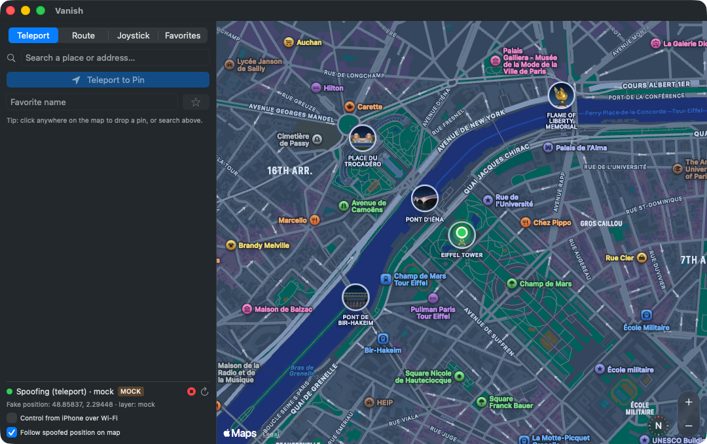
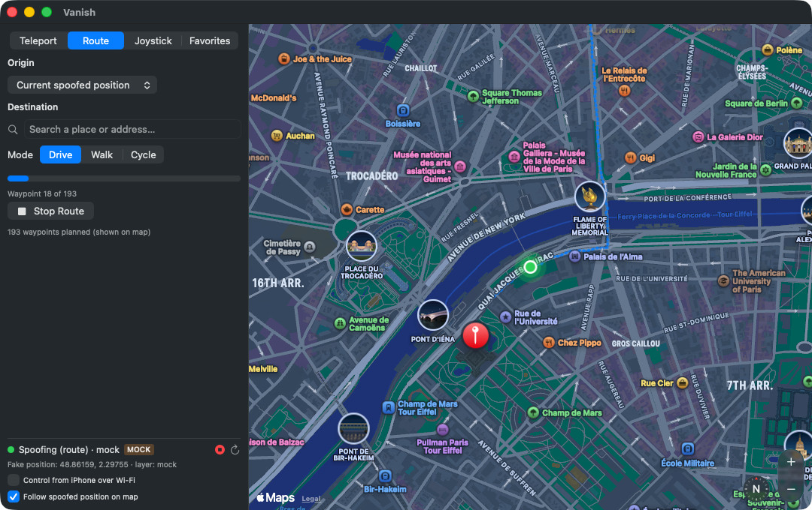
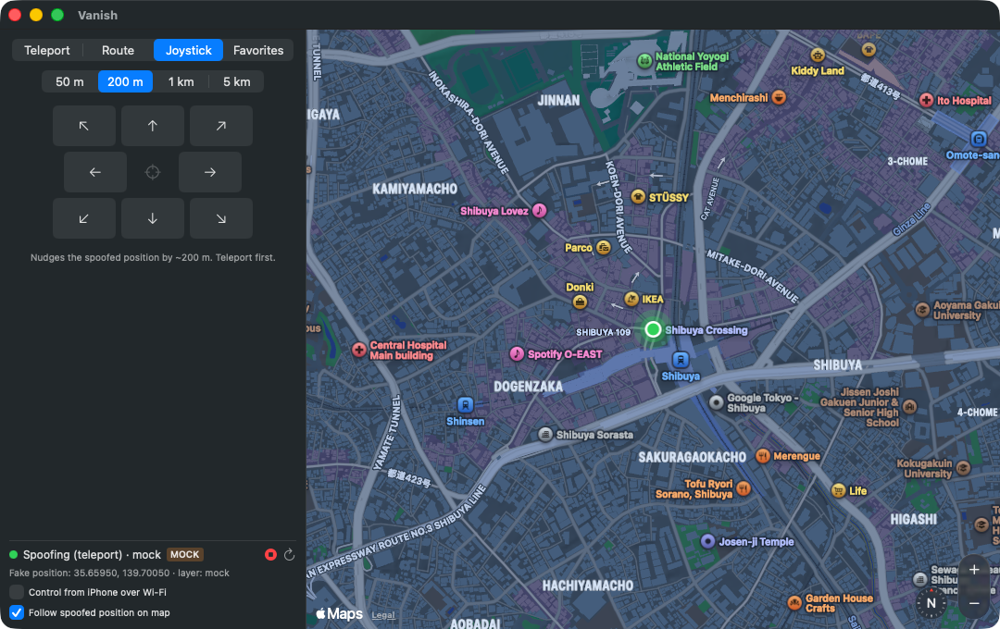
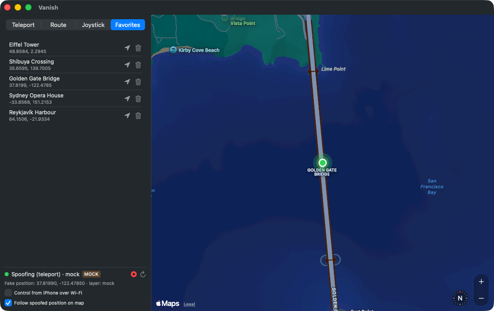
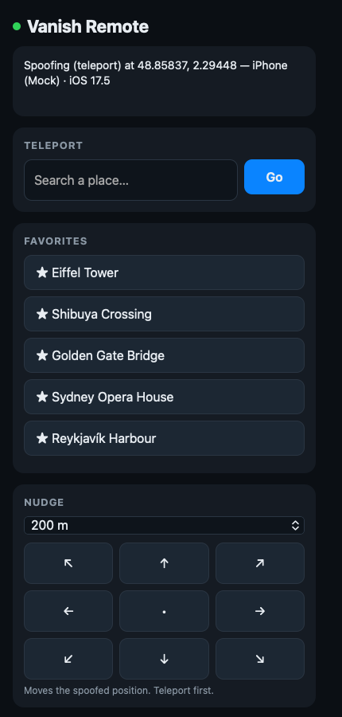

<p align="center">
  
</p>

# Vanish

[](https://github.com/praveetgupta/vanish/actions/workflows/ci.yml)
[](LICENSE)
[](#requirements)
[](#which-iphones-work)
[](#how-the-injection-works)

**Change where your iPhone thinks it is, from your Mac.** Vanish is a native macOS app that feeds a simulated GPS location to a connected iPhone over Apple's own developer pathway — click a map, and the phone believes it. No jailbreak, no profiles, no modified apps; the phone stays completely stock.

Teleport anywhere, walk or drive a **real road route** at a believable speed, nudge the position with a joystick, save favorites, and drive the whole thing from the phone itself over Wi-Fi.



<table>
<tr>
<td width="50%"><br><em>Route — a real Apple Maps route, walked at a human speed</em></td>
<td width="50%"><br><em>Joystick — nudge the position 50 m to 5 km at a time</em></td>
</tr>
<tr>
<td width="50%"><br><em>Favorites — one click back to places you use</em></td>
<td width="50%" align="center"><br><em>Phone remote — control it from the iPhone itself</em></td>
</tr>
</table>

> Screenshots are from `--mock` mode, which runs the whole app against a fake device so you can try it without an iPhone attached.

## Contents

- [Why this exists](#why-this-exists)
- [How it works](#how-it-works)
- [Requirements](#requirements)
- [Install](#install)
- [Using it](#using-it)
- [Control it from your phone](#control-it-from-your-phone)
- [Command line](#command-line)
- [Engine API](#engine-api)
- [How the injection works](#how-the-injection-works)
- [Try it without an iPhone](#try-it-without-an-iphone)
- [Troubleshooting](#troubleshooting)
- [Repo layout](#repo-layout)
- [Responsible use](#responsible-use)

## Why this exists

iOS has no user-facing way to set your location. Xcode does — *Debug → Simulate Location* — but that only works while your own app is being debugged, it teleports (no movement), and it means keeping Xcode open.

Underneath, Xcode is talking to a developer service on the phone that will accept a coordinate from any paired Mac. Vanish talks to that same service directly, and wraps it in the interface the feature always deserved: a map you click, routes that actually move, and a stop button that gives you your real GPS back.

Everything runs on your machine. No account, no server, no telemetry, nothing leaves the Mac except map tiles and place searches from Apple Maps and OpenStreetMap.

## How it works

Two pieces. A SwiftUI Mac app for the interface, and a small local Python engine that owns the USB connection to the phone and keeps the simulated-location session alive.

```
┌──────────────────┐                        ┌────────────────────────────┐
│    Vanish.app    │  HTTP 127.0.0.1:8799   │      engine/daemon.py      │
│                  │ ─────────────────────▶ │                            │
│  SwiftUI + MapKit│  {"lat":…, "lon":…}    │  pymobiledevice3           │
│  map · routes    │ ◀───────────────────── │  ↓                         │
│  joystick · menu │      status/hints      │  USB / RSD tunnel          │
└──────────────────┘                        └─────────────┬──────────────┘
        ▲                                                 │
        │ same JSON API                                   ▼
┌───────┴──────────┐                        ┌────────────────────────────┐
│  iPhone browser  │                        │   iPhone location service  │
│  (Wi-Fi remote)  │                        │   com.apple.dt.simulate…   │
└──────────────────┘                        └────────────────────────────┘
```

Splitting it this way is what makes the phone remote possible: the engine is the only thing that talks to the device, and *everything* — the Mac app, the CLI, the phone's browser — is just a client of the same local JSON API.

## Requirements

- **macOS 14 (Sonoma) or later**, Apple silicon or Intel.
- **Python 3.11+** (`brew install python`) — the engine runs in its own venv, created for you.
- **Swift toolchain** — full Xcode or the Command Line Tools (`xcode-select --install`).
- **An iPhone**, connected by USB cable, that has been unlocked and "Trust this computer" accepted.
- **Developer Mode** on the phone for iOS 16 and later: *Settings → Privacy & Security → Developer Mode* → on, then restart. The toggle only appears after the phone has been plugged into a Mac with developer tooling at least once.

No paid Apple Developer account. No jailbreak. No app installed on the phone.

### Which iPhones work

| iOS | Pathway | Needs |
| --- | --- | --- |
| 14 – 16 | Lockdown `com.apple.dt.simulatelocation` | Just a cable and Trust |
| 16 – 17 | DVT Instruments over usbmux | Developer Mode |
| 17+ | DVT over a native `remotepairingd` tunnel | Developer Mode, macOS only, **no root** |
| 17+ | DVT over an RSD tunnel | `sudo pymobiledevice3 remote tunneld` running |

Vanish tries these in order and uses the first that opens, so on most setups you never think about it. The status bar tells you which layer it landed on.

## Install

```bash
git clone https://github.com/praveetgupta/vanish.git
cd vanish
./scripts/make_app.sh --install
```

That creates the engine's virtualenv, installs `pymobiledevice3`, builds the Swift app in release mode, assembles `Vanish.app` with the engine embedded inside it, ad-hoc signs it, and copies it to `/Applications`.

Drop `--install` to build `./Vanish.app` in place without touching `/Applications`. Re-run the script after pulling changes.

The app is signed ad-hoc (`codesign -s -`) because you built it yourself on your own machine. There is no notarized download — building from source is the intended path.

## Using it

Open Vanish. It starts the engine on first use and finds the phone by itself; the status bar at the bottom left shows the device name and iOS version.

**Teleport** — search for a place or click anywhere on the map to drop a pin, then hit *Teleport to Pin*. The green puck is where your phone now thinks it is. Give a pin a name and press ★ to keep it.

**Route** — pick a destination and a travel mode, and Vanish asks Apple Maps for a real route, then walks it as a timed series of waypoints at a plausible speed (1.4 m/s walking, 4.7 cycling, 11.5 driving) with per-tick speed variation and a few metres of GPS jitter, so the trace does not look like a machine playing back a straight line. Progress shows waypoint by waypoint and the route is drawn on the map.

**Joystick** — nudge the current position by 50 m, 200 m, 1 km or 5 km in any of eight directions. Useful for fine adjustment after a teleport.

**Menu bar** — the ⌖ icon gives you status, your first six favorites as one-click teleports, and a stop button, without opening the window. *Quit & Stop Spoofing* makes sure the phone is handed back its real GPS on the way out.

**Stopping** — the toolbar stop button, the menu bar, or `cli.py stop`. Vanish clears the simulation and tears down the tunnel, which is the "unplug the cable" equivalent that guarantees iOS falls back to the real GPS. Open Apple Maps on the phone for an instant fix; Find My can lag a few minutes when the phone is sitting still.

The engine also runs a **startup rescue**: if a previous run was force-killed with a location still simulated, the next start clears it before doing anything else, so the phone never gets stuck somewhere.

## Control it from your phone

Tick **Control from iPhone over Wi-Fi** in the status panel. The engine restarts bound to your LAN and shows a URL and a six-digit PIN:

```
http://192.168.1.42:8799 · PIN 418093
```

Open that on the phone and you get the remote page in the screenshot above — status, place search, your favorites, a nudge pad and a big stop button. It is a plain web page, so nothing gets installed.

Requests from outside `127.0.0.1` must carry the PIN, which is regenerated every time the engine starts. Leave the toggle off and the engine binds to localhost only, where nothing on your network can reach it at all.

## Command line

```bash
engine/cli.py status                       # engine, device and session state
engine/cli.py devices                      # visible iPhones
engine/cli.py teleport "Eiffel Tower"      # geocoded via OpenStreetMap
engine/cli.py teleport --lat 48.8584 --lon 2.2945
engine/cli.py move --lat 48.86 --lon 2.30
engine/cli.py stop
```

The engine has to be running — open the app, or start it yourself with
`engine/venv/bin/python engine/daemon.py`.

Worth an alias:

```bash
alias vanish="$PWD/engine/venv/bin/python $PWD/engine/cli.py"
```

## Engine API

Plain JSON over `127.0.0.1:8799`. This is the whole surface — the Mac app has no privileged path of its own.

| Method | Path | Body | Does |
| --- | --- | --- | --- |
| `GET` | `/api/status` | | Engine, device, session, route progress, hints |
| `GET` | `/api/devices` | | Visible iPhones |
| `GET` | `/api/favorites` | | Favorites saved by the Mac app |
| `GET` | `/api/geocode?q=` | | Place search via OpenStreetMap Nominatim |
| `POST` | `/api/spoof` | `{lat, lon}` | Teleport; starts or replaces the session |
| `POST` | `/api/move` | `{lat, lon}` | Move within the active session |
| `POST` | `/api/route` | `{points:[{lat,lon,delay_ms}], loop}` | Play a timed route |
| `POST` | `/api/stop` | `{}` | Clear the simulation |
| `POST` | `/api/refresh` | `{}` | Rescan for devices |
| `POST` | `/api/shutdown` | `{}` | Stop spoofing and exit cleanly |

So a shell one-liner is a perfectly good client:

```bash
curl -s -X POST -d '{"lat":48.8584,"lon":2.2945}' http://127.0.0.1:8799/api/spoof
```

## How the injection works

`engine/injector.py` walks four developer pathways and keeps the first that opens. Every one of them is a documented Apple service that Xcode itself uses.

1. **Lockdown `com.apple.dt.simulatelocation`.** The oldest and simplest: a fresh lockdown connection per command, nothing to keep alive. Usually works on iOS 16 and earlier without Developer Mode.
2. **DVT Instruments `LocationSimulation` over usbmux.** Xcode's own mechanism — a persistent DTX channel over USB. Needs Developer Mode on iOS 16+.
3. **DVT over a native tunnel.** On iOS 17+ Apple moved the developer services behind an RSD tunnel. On macOS, `pymobiledevice3` can piggyback `remotepairingd` — the same daemon Xcode uses — so this needs **no root**, which is the path most people end up on.
4. **DVT over `tunneld`.** The fallback for iOS 17+ when the native tunnel is unavailable. Run `sudo engine/venv/bin/pymobiledevice3 remote tunneld` in a terminal and leave it going; the app shows a hint banner when this is what is needed.

When every layer fails, the error you get back is the checklist of what to fix, with the underlying exception from each attempt appended — not a generic "could not connect".

## Try it without an iPhone

```bash
engine/venv/bin/python engine/daemon.py --mock
open Vanish.app
```

Mock mode fakes a device and accepts every command, so the map, routes, joystick, favorites, phone remote and CLI all work with nothing plugged in. The app shows an orange **MOCK** badge so there is no confusing it with the real thing.

To go back to real spoofing, stop the mock engine and let the app start its own:

```bash
pkill -f "daemon.py --mock"
open Vanish.app
```

## Troubleshooting

**"No iPhone detected"**
Cable actually plugged in, phone unlocked, Trust accepted? Then press ↻ in the status bar, or run `engine/cli.py devices`. A phone that has only ever been on Wi-Fi shows up too, but a cable is far more reliable for the first pairing.

**"Could not open a location-simulation session"**
Read the detail in the message — it lists what each layer tried. In order of likelihood: Developer Mode is off, the phone is locked, or you are on iOS 17+ and need pathway 4:

```bash
sudo engine/venv/bin/pymobiledevice3 remote tunneld
```

**The location does not change on the phone**
Some apps cache aggressively. Apple Maps is the honest test — it picks up a simulated fix within a second or two. Find My updates on its own schedule and is a bad way to check.

**The fake location is stuck after a crash**
Start the engine again and press stop; the startup rescue clears leftovers by itself. If it is truly wedged, rebooting the phone always clears it, because simulated location never survives a restart.

**Route playback stops partway**
The phone probably went to sleep or dropped off USB. The engine surfaces the error as a hint banner and falls back to a plain teleport at the last waypoint.

## Repo layout

```
app/                    Swift package — the Mac app
  Sources/Vanish/
    App.swift           App entry point and menu-bar extra
    AppState.swift      Observable state, actions, favorites
    Engine.swift        HTTP client, engine launcher, models
    MapView.swift       MapKit view — pin, spoofed puck, route overlay
    RoutePlanner.swift  Apple Maps directions → timed waypoints
    Views.swift         Teleport, Route, Joystick, Favorites, status
engine/
  daemon.py             Local HTTP engine + phone remote page
  injector.py           The four device pathways, over pymobiledevice3
  cli.py                Command-line client
  requirements.txt      pymobiledevice3
scripts/
  make_app.sh           venv + swift build + icon + bundle + sign + install
  make_icon.swift       renders the app icon at build time
docs/ARCHITECTURE.md    How the pieces fit together
```

See [docs/ARCHITECTURE.md](docs/ARCHITECTURE.md) for the session lifecycle and the threading model.

## Uninstall

```bash
osascript -e 'quit app "Vanish"'
pkill -f daemon.py
rm -rf /Applications/Vanish.app
rm -rf ~/Library/Application\ Support/Vanish
```

Nothing is left on the iPhone — Vanish never installs anything there. Any simulated location dies with the session, and certainly with a reboot.

## Responsible use

Vanish drives Apple's own developer location-simulation service on a device you have physically unlocked and paired. It does not jailbreak the phone, patch binaries, bypass code signing, or touch other people's devices.

What you point it at is on you:

- **Games.** Pokémon GO and everything like it treat location spoofing as cheating. Accounts get banned. That is between you and them.
- **Fraud is illegal.** Faking your location to defeat geographic restrictions, alibi yourself, or deceive a service you are transacting with is not a grey area.
- **The App Store forbids this class of app**, which is why Vanish is source you build yourself rather than something you download.
- Reasonable uses do exist: testing your own location-aware app against real geography, keeping a precise home address out of apps that demand location for no good reason, and checking what a service does when you appear to be somewhere else.

## Contributing

Issues and pull requests welcome — see [CONTRIBUTING.md](CONTRIBUTING.md).

## License

[MIT](LICENSE) © 2026 Praveet Gupta

Built on [pymobiledevice3](https://github.com/doronz88/pymobiledevice3), which does the hard part of speaking Apple's device protocols.
